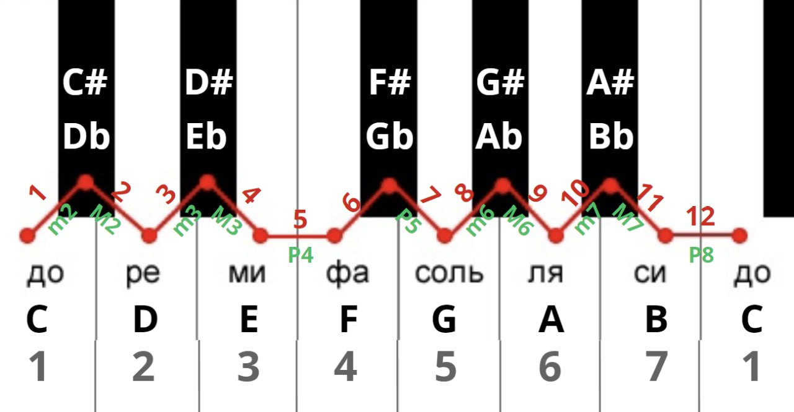

## Intervals

### Construct Interval
In this task we build an **Interval** according to the *First Note* (Note that our interval starts with)
and Note order (Order of notes in our interval).
<br>
We have 2 conventional types of order:
* Ascending
* Descending

In input argument Array we have 2 or 3 args:
* args[0] - Interval name. It's the interval we intend to construct
* args[1] - First Note. It's Note our further constructed interval starts with
* args[2] (optional) - Note order. Order of notes in constructional interval (asc|dsc). If not present - by default pick asc.


#### Algorithm

Primarily let's make a picture, circuit of our Intervals and Notes.



According to that picture we can consider that Notes and Intervals as entire circle.<br>
Let's define a sequence of the Notes.<br>
Let it be a common sequence, the same as we have on the picture.<br>
We see that we have **8** Intervals and **7** Notes.
After we overlap current iteration (Pass elements from 'C' to 'B' -> next Iteration starts with the same 'C' etc.) we begin next one. <br>
So we have cyclic dependency. As a result we can define a DEFAULT `index` for each Note.<br>
This `index` - is Interval number. Interval number will be number in interval sequence in their order.<br>
Example:
```java
    m2 - 1
    M2 - 2
    m3 - 3
    M3 - 4
    P5 - 5 
    ...
```

According to the picture. We define the following DEFAULT indexes for Notes:
```java
    C - 1
    D - 2
    E - 3
    F - 4
    G - 5
    A - 6
    B - 7
```

As u see. Our Note DEFAULT indexes equal to Interval `index`. Therefore, let's call it DEFAULT DEGREE.
Consider the case when we pick our Notes and Intervals in their order -> each interval has its own strict degree.
The same situation with Notes. So it's the `most appropriate case for us`. <br>
After we will use this case as sth that we expected after any operations.<br>
Moreover, we have SEMITONE number. According to the picture we can observe DEFAULT semitone number for each Note.

All in all, after such assertions we can say that each of Note has its own coordinates (x,y).
X - degree, Y - semitone.

Default coordinates for each Note.

| Name | Degree | Semitone |
|:----:|:------:|:--------:|
|  C   |   1    |    0     |
|  D   |   2    |    2     |
|  E   |   3    |    4     |
|  F   |   4    |    5     |
|  G   |   5    |    7     |
|  A   |   6    |    9     |
|  B   |   7    |    11    |

After that we can use this table as reference is we're going to construct Interval.<br>
That coordinates - sth we anticipate as a result. It's expected result of construction.<br>

##### Construct Interval
We have:
* Interval
* First Note
* Order

Define degree coordinate for Interval last Note:<br>
```java
//ASC
    int lastNoteDegree = constructedIntervalFirstNote.get(DEGREE_PROPERTY) +
            constructedInterval.get(DEGREE_PROPERTY) - 1;

    if (lastNoteDegree >= MAX_INTERVAL_COUNT) // indicates that we have a note step over the note 'B' - 1 more additional semitone to achieve note 'C'
        lastNoteDegree = lastNoteDegree - MAX_INTERVAL_COUNT + 1;
    
 //DESC
     int lastNoteDegree = constructedIntervalFirstNote.get(DEGREE_PROPERTY) -
            constructedInterval.get(DEGREE_PROPERTY) + 1;
     // 0 or less
     if (lastNoteDegree < MIN_INTERVAL_COUNT)
        lastNoteDegree = lastNoteDegree + MAX_INTERVAL_COUNT - 1;
```

**ASC**
<br>
Subtract `1` because we start count intervals from the next one. <br>
If `if (lastNoteDegree >= MAX_INTERVAL_COUNT)(8)`<br>
Thanks to our cyclic dependency we obtain `last note degree` in the next iteration:
`lastNoteDegree = lastNoteDegree - MAX_INTERVAL_COUNT + 1`<br>
Add `1` because we have 1 transition interval to next iteration. This interval is interval between Notes `B` - `C`.<br>

**DESC**
<br>
Vice verse in comparison with **ASC**.<br>
Add `1` to find `lastNoteDegree` because we start counting from current interval.
Thanks to our cyclic dependency we obtain `last note degree` in the next iteration:
`lastNoteDegree = lastNoteDegree + MAX_INTERVAL_COUNT - 1`<br>
Subtract `1` because we have 1 transition interval to next iteration. This interval is interval between Notes `B` - `C`.<br>

So after we can say which Note it will be (our *expected* note), according to 1st coordinate. We assume that note with the same index will be an expected Note.<br>
To give ultimate answer we have to compare difference in semitones of our *expected* and *actual* last notes.
To find actual Note semitone we use the following:
```java
//ASC
    int actualSemitoneNumber = constructedInterval.get(SEMITONE_PROPERTY) +
             constructedIntervalFirstNote.get(SEMITONE_PROPERTY);

     if (actualSemitoneNumber >= MAX_SEMITONE_NUMBER)
        actualSemitoneNumber -= MAX_SEMITONE_NUMBER;
     
//DESC
    int actualSemitoneNumber = constructedIntervalFirstNote.get(SEMITONE_PROPERTY) -
            constructedInterval.get(SEMITONE_PROPERTY);

    if (actualSemitoneNumber <= MIN_SEMITONE_NUMBER)
        actualSemitoneNumber += MAX_SEMITONE_NUMBER;
```

Thanks to our cyclic dependency we obtain `actualSemitoneNumber` in the next iteration:<br>
`actualSemitoneNumber -= MAX_SEMITONE_NUMBER;` for **ASC** <br>
`actualSemitoneNumber += MAX_SEMITONE_NUMBER;` for **DESC**
<br>

Next step is to compare *Actual* and *Expected* semitones.<br>
On the one hand if the difference is `-1` or `-2` we should add `b` or `bb` to our expected Note to obtain actual.<br>
On the other hand if the difference is `1` or `2` we should add `#` or `##` to our expected Note to achieve actual.<br>
If difference is `0` it signify that actual and expected Notes' semitones are equals (obtain Note we are expecting).<br>
According to that we produce correct Note with a certain semitone.

---

### Identify Interval
In this task identify the **Interval** according to the *First Note* (Note that our interval starts with),
*Last Note* and Note order (Order of notes in our interval).
<br>
We have 2 conventional types of order:
* Ascending
* Descending

In input argument Array we have 2 or 3 args:
* args[0] - First Note name. First note of identical interval.
* args[1] - Last Note. Last note of identical interval.
* args[2] (optional) - Note order. Order of notes in identical interval (asc|dsc). If not present - by default pick asc.

#### Algorithm

Overall algorithm to identify Interval is a dead ringer of algorithm to construct interval.
So brief description.<br>

Define coordinates of 2 given to us Notes: 
1. Find degree difference between Notes:
```java
//ASC
        int degreeDifferenceBetweenNotes = lastNote.get(DEGREE_PROPERTY) -
                firstNote.get(DEGREE_PROPERTY) + 1;

         if (degreeDifferenceBetweenNotes < MIN_INTERVAL_COUNT) // indicates that we have a note step over the note 'B' - 1 more additional semitone to achieve note 'C'
            degreeDifferenceBetweenNotes = degreeDifferenceBetweenNotes + MAX_INTERVAL_COUNT - 1;
//DESC
        int degreeDifferenceBetweenNotes = firstNote.get(DEGREE_PROPERTY) -
                lastNote.get(DEGREE_PROPERTY) + 1;

        if (degreeDifferenceBetweenNotes < MIN_INTERVAL_COUNT) // indicates that we have a note step over the note 'B' - 1 more additional semitone to achieve note 'C'
            degreeDifferenceBetweenNotes = degreeDifferenceBetweenNotes + MAX_INTERVAL_COUNT - 1;
```

2. Find semitone difference between Notes:
```java
//ASC
        int notesSemitoneDifference = lastNote.get(SEMITONE_PROPERTY) -
                firstNote.get(SEMITONE_PROPERTY);

         if (notesSemitoneDifference <= MIN_SEMITONE_NUMBER)
            notesSemitoneDifference += MAX_SEMITONE_NUMBER;
//DESC
         int notesSemitoneDifference = firstNote.get(SEMITONE_PROPERTY) -
             lastNote.get(SEMITONE_PROPERTY);

         if (notesSemitoneDifference <= MIN_SEMITONE_NUMBER)
                notesSemitoneDifference += MAX_SEMITONE_NUMBER;
```

3. According to Semitone difference and Degree difference we find a certain Interval, which corresponds to these properties.
If Such Interval is not found throw Exceptioin.